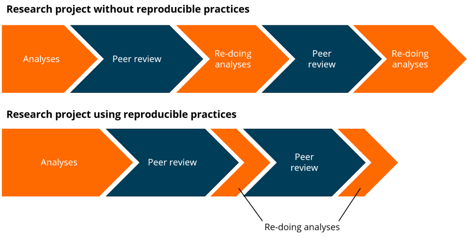

```{r setup, echo=F, include=F}
library(tidyverse)
library(ukhsaGuidanceDocs)
knitr::opts_chunk$set(echo = F)

SetUpReferenceList("../- assets/QPD knowledge bank.xlsx")

```


## Coverage

This guidance applies to any analysis of numerical information. 


## Summary of recommendations

1. All analysts should aim towards "Reproducible Analytical Pipelines (RAP) by default" ways of working, as part of broader Government aims.
1. Iterative improvements should be made to analytical pipelines to work towards meeting the bronze, silver and gold standards outlined in this guidance
1. A cultural change should be supported at all levels in the organisation to encourage the enhanced roll-out of RAP, ensuring that analysts have the tools, time and resources needed to develop and implement the necessary skills. 


## Introduction

Good analysis should be reproducible, transparent, trustworthy, auditable, efficient, and high quality `r addRef(1, 18, 23, 28, 32, 34, 35, 41)`.

The principles of RAP draw upon best practices from the field of software engineering to achieve these aims `r addRef(18, 23, 50)`. They avoid the pitfalls associated with more manual processes reliant on opaque "point-and-click" operations which are inefficient and make it difficult to reproduce analyses, also making it hard to quality assure or audit the same `r addRef(18)`. 

Having a transparent and reproducible production pipeline allows us to show that we have done what we have said we have done `r addRef(28)`. It allows our users and other analysts to follow and reproduce the process and understand the results `r addRef(28)`. Good peer review and audit also rely on reproducibility, which further promotes the quality of, and trust in, our statistics `r addRef(18, 28)` (two of the main pillars of the Code of Practice for Statistics `r addRef(1)`).

Despite having clear benefits, many analysts still rely on those legacy processes which are prone to error and are difficult to reproduce `r addRef(28, 35, 20)`. There are more than 800 National Statistics across Government, and many more Official Statistics and other statistical publications, meaning the potential benefits of RAP are therefore huge `r addRef(31)`. 

The aim for UKHSA, and across Government, is to work towards "RAP by default" for all analysis `r addRef(41, 35)`. A cultural change is needed to achieve this. The purpose of this guidance is to help drive this change, outlining what RAP is, and how to achieve it. 


## The principles of RAP

### Issues with legacy production processes

Legacy analytical pipelines tend to look like the one presented in Figure 1. Here, data is manually extracted from some central database, which might be done by another team, and saved on a local or network drive. Proprietary software such as SPSS, SAS and or Excel is then used to process that data, relying on manual "point-and-click" operations. Charts and tables are separately produced, which are then copied and pasted into a word document. The text in the report is manually updated. That document is emailed for quality assurance and returned for revisions. The word document is then saved as a pdf or converted to markdown, ready for publication. 


#### Figure 1: Legacy processes tend to have limited quality assurance and several manual steps


*Note: Figure taken from the UK Government Data Science RAP Companion* `r addRef(40)`

<br>

There are a number of potential issues and sources of error with this kind of pipeline, such as:

* where data is manually extracted from a data store, there might not be a record of how exactly that was done, such as which filters were applied - this might be particularly problematic if the data was extracted by another team, as the analyst working on the project does not know how exactly the data was prepared 
* when a snapshot of the data is saved on a network drive and used for analysis, version control issues may mean outputs cannot be reproduced - there may be multiple versions saved of the data saved without a record of which version was actually used, and the data may be overwritten or deleted at a later date
* there is often no proper version control over code and documents, which can make it difficult to know which files are the most up to date, particularly when multiple versions are saved, and particularly when multiple versions are being emailed between colleagues during reviews - this makes quality assurance difficult, and it may not be possible to reproduce earlier findings 
* where data is saved on a local drive, other analysts may not be able to access it (for example, should the usual analyst go on leave, or leave the organisation)
* where there isn't full documentation, there is a reliance on analysts remembering which series of steps to take to produce an output - when those analysts leave the organisation or go on leave, it may be difficult for others to reproduce those steps
* the reliance on point-and-click operations can be prone to human error - even where there is documentation on what point-and-click operations should be followed (and there often isn't with these kinds of pipelines), there is no audit trail of what steps were actually undertaken as they are not written in code, making quality assurance difficult. 
* where proprietary (not open source) software is used, it might mean other analysts cannot replicate the process (if they do not have access to this software) 
* human error may occur when copying numbers, tables and charts into the word document, as some may be missed when updating a report, particularly when in a rush following a last minute data re-submission - this is also particularly true when proprietary software is used as output formats tend to be more restricted, meaning numbers, tables and charts must be manually copied into a word document, rather than having that word document populated automatically through code
* human error may also occur when manually transforming outputs into markdown ready for publication in HTML format (which is now a requirement to comply with accessibility law) 
* quality assurance at the end of the process may fail to highlight issues occurring during the earlier analytical steps 


### The benefits of RAP

By implementing a Reproducible Analytical Pipeline (RAP), these issues can be overcome. 

Figure 2 shows that when using RAP, open source software such as R (or Python) is used to automate the end-to-end process from data extraction to analysis, through to the automated production of a variety of possible outputs (for example, markdown for HTML, pdf, spreadsheets). In a fully implemented RAP process, there are no manual point-and-click operations. Because the analysis is fully documented through programming code, quality assurance and version control can be more easily integrated into all stages of the pipeline. 


#### Figure 2: RAP projects are automated and quality assurance and version control is integrated


*Note: Figure taken from the UK Government Data Science RAP Companion* `r addRef(40)`

<br>


The benefits of RAP are well documented `r addRef(18, 28, 41, 50, 31, 35, 24, 27)`. A number of case studies lauding the successes of RAP across government have also been published `r addRef(31, 24, 22, 19)`.

Compared with legacy pipelines, RAP:

* significantly reduces risks associated with human error (for example, during analysis and copy-paste errors) because there is an audit trial of the actual steps taken, which can be quality assured
* enables better version control, meaning there is a clearer record of which files were used to produced outputs and what changes to the pipeline might have been made
* is more reliable and consistent, because full documentation of the process means outputs can be easily reproduced, also making the pipeline more resilient to staff turnover
* enables better quality assurance built into all stages of the end-to-end pipeline, not just on the final product, leading to better quality 
* improves transparency, as the documented pipeline can be shared, building trust and confidence in our outputs among users
* can be used to automate the production of multiple possible outputs (for example, documents, spreadsheets, slides, interactive visualisations) in a single pipeline
* means that the code used for analysis can be adapted and re-used in other projects
* provides a morale boost to analysts when laborious tasks can be automated
* is more efficient by avoiding time-consuming manual processes, particularly when analyses need to be run multiple times, which in turn: 
    * leads to cost savings in terms of analysts' time
    * frees up more time for more value-added activities such as better and more innovative data visualisations, enhanced quality assurance, greater consideration and interpretation of trends, greater user engagement, and developing novel analyses


RAP does require upskilling to learn the programming skills required. However, that investment is certainly worth it to bring out the benefits for individual projects described above, and the more general benefits to the analysts that developing these skills will bring. 

It also does require more time at the start of an analytical project to write the necessary code, compared to legacy approaches. However, this creates time savings in the longer term, particularly when analyses have to be repeated. This is demonstrated in Figure 3. While in a legacy pipeline the initial analysis is quicker than for RAP, it takes the same amount of time each time the analysis is repeated (for example, for the next iteration of the report, or following a data re-submission), meaning the overall project is a lengthy one. While the initial analysis step is longer for RAP, each subsequent running of the code can take a fraction of the time, meaning overall time is saved. The potential overall time savings for regular reports are significant. 


#### Figure 3: Reproducible practices makes analysis faster {#fig3}



*Note: Figure taken from the Analysis Function Reproducible Analytical Pipelines (RAP) strategy* `r addRef(18)`

<br>


## Standards of RAP

"Minimum" and "further" standards of RAP have been developed by the Government Analysis Function `r addRef(18)`. These are intended to provide major benchmarks for analytical teams to work towards. 

However, it is important to stress that RAP does not need to be an all or nothing exercise. We would like all analytical teams to eventually meet one of these standards, but even implementing just some of these principles will bring about improvements to your processes and outputs `r addRef(41, 31)`. Trying to achieve all of these standards in one go may be too daunting a task and so incremental improvements are the suggested way to go. 

It is also important to recognise that some of principles that form these standards may not always be possible. For example, where remote connections to databases are not permitted, some manual work may be needed to extract the data for use in analysis. In such cases, the aim should be to apply RAP to the other areas where RAP principles can be applied `r addRef(23)`.(However, it is preferred to have a direct connection to databases wherever possible, as any "black-box" processes conducted in extracting and preparing data for analysis might undermine some of the benefits of RAP `r addRef(35)`.)

Our guidance presented below draws upon the same principles developed by the Analysis Function and others, but we have separated them out into 3 standards (bronze, silver and gold) instead of the Analysis Function's 2 (minimum and further). This is to make it easier for teams to progress through the standards in smaller leaps. Each subsequent standard reflects a more transparent, reproducible and robust pipeline. 

In our silver standard, some principles have come from the Analysis Function's minimum standard, and others from their further standards. Specifically:
 
* "minimise manual steps" has been separated out into two principles covering manual steps during analysis and manual steps during the production of spreadsheets and workbooks, with the former remaining in the minimum bronze standard and the latter being moved to the silver standard - this is to recognise the fact that many analysts will develop the programming skills needed for analysis first, before developing other skills around Rmarkdown, for example. 
* "using version control software" has also been moved from the minimum standard to the silver standard for similar reasons (learning Git tends to come after learning R or Python)
* "validating input data", "using functions", and "adhere to a common best practice code style" have all been moved to the silver standard from the further standard because these are usually easier to implement than the other further standard principles.


Aside from these differences, all other Analysis function "minimum" standard principles are in our bronze standard, and all other Analysis Function "further" standard principles are in our gold standard.

We will be implementing a "RAP register" alongside our guidance to map different our analytical pipelines against these standards, to measure progress, to map knowledge (so that it can be shared!), and to celebrate our successes! The RAP register is available to internal UKSHA colleagues only. Those colleagues can [contact us](mailto:UKHSA_HOPSTATS@ukhsa.gov.uk) for a link. For non-UKHSA people, [the example template can be found on our GitHub repository](https://github.com/UKHSA-Statistics-Production/knowledge-hub/tree/main/RAP). 


#### Bronze standard

The checkboxes in the following lists are there for you to use when assessing your pipeline.

To meet the bronze standard for RAP, your project should :

* <input type="checkbox"> use peer review for quality assurance, to ensure that the analysis is accurate and reproducible, and that the pipeline meets the rest of this standard

* <input type="checkbox"> have minimal manual steps (for example, minimal copy-paste, point-click, drag-drop operations) for data extraction where permissions allow (for example, using SQL code), and for the analysis steps used to produce numbers, tables and charts 

* <input type="checkbox"> use open source analytical software (preferably R or Python)

* <input type="checkbox"> integrate quality assurance checks throughout the analysis, automated where appropriate, supplemented with semi-automated or manual checks (we will be producing further guidance on this in due course) 

* <input type="checkbox"> have well-commented code and documentation embedded as part of the project, rather than being saved elsewhere

* <input type="checkbox"> be open and available to other analysts (including external users where appropriate)


The purpose of the peer review here is to ensure that the analysis is fully reproducible by running it on a different machine and getting the same results without input from the original author. The review should also ensure the pipeline appropriately follows the other principles outlined by this standard (and the silver and gold standards, should the pipeline also meet the principles outlined there). 

While automation is encouraged, this does not mean the entire pipeline needs to be run in one step. For example, trying to pull and shape data and produce outputs in the same line(s) of code might make it difficult for other analysts to follow what you are doing or reuse parts of your code for similar projects `r addRef(50)`. Instead, your project might be separated out into several scripts denoting different stages of the pipeline. For example, you might have one script that pulls the data from the data store and condenses it down into one or more minimum tidy datasets: defined as the minimum amount of data needed to complete the publication `r addRef(50)`. Those datasets can then be passed through an RMarkdown script to produce the report (or easily picked up for use in different projects!). 

Modern tools such as R or Python are preferred over legacy tools such as SPSS or SAS because they are better at reading a range of different data formats, support modularised code, and can be used to create outputs in a range of different formats (for example, markdown, HTML, PDF, and Microsoft Word, Excel and PowerPoint files) `r addRef(27)` - this will become important for meeting the silver standard principles later on. They also reduce (or eliminate) the number of times where data needs to be moved from one programme into another (for example, from SPSS into Excel into Word) `r addRef(40)`.

Simply being reproducible does not mean that you are doing your analysis correctly `r addRef(39)`. It is important to quality assure each stage of the process. Checks should be built in at various points throughout the code to flag anything unexpected for further (human) exploration. These might print warning messages into the console for example, or output more detailed markdown files flagging where potential issues might exist. Note that while many quality assurance checks can be automated, some human input will always be needed, such as for final proof readings and checking that automated text still matches the figures `r addRef(50)`. Quality assurance should align with the principles outlined in the Aqua Book `r addRef(34)` and the Code of Practice for Statistics `r addRef(1)` for those who have adopted the code. We will be producing further guidance on this in due course.

Having good quality documentation accompanying your code is important for reproducibility. The simplest form of documentation is code comments. These can be supplemented with additional documentation such as a "README" file `r addRef(35, 27)`. Good documentation will help improve the reuse of code, either by other analysts using it for the first time or by the same analyst using it in the future `r addRef(35)`. It should explain what the code does and how it can be used, including what options or parameters are available, examples of how to run it, and an explanation of any software or environment dependencies `r addRef(39)`.

It is a good idea to make code available to others because this means that the pipeline can be reproduced should the usual analyst go on leave or leave the organisation. It should be stored in a place that is accessible to others (not on a local drive). Keeping code in a repository such as GitHub can also make it easier to find and provides a back up in case of accidental deletion `r addRef(39)`. Anything hard coded, such as local filepaths, should be removed `r addRef(39)`. Ideally, the code should be made publicly available for transparency. However, this may not be appropriate where sensitive materials are involved `r addRef(40)`. 


#### Silver standard

To meet the silver standard for RAP, your project should:

* <input type="checkbox"> achieve all of the points covered under the bronze standard

* <input type="checkbox"> have minimal manual steps (for example, minimal copy-paste, point-click, drag-drop operations) for the production of spreadsheet workbooks and reports for publication 

* <input type="checkbox"> use functions as reusable blocks of code

* <input type="checkbox"> have automated input data validation

* <input type="checkbox"> use version control software such as Git and GitHub to create and maintain a recorded history of the project

* <input type="checkbox"> adhere to a common best practice code style


A good test for the reproducibility of your project is to think whether or not your outputs are deletable without worry. If you would not want to delete your outputs, because it would take time and energy to re-make them, then your end-to-end pipeline is likely not fully automated `r addRef(28)`.

There are packages available to help produce reports automatically, such as [RMarkdown](https://rmarkdown.rstudio.com/) and [Python-Markdown](https://pypi.org/project/Markdown/). Spreadsheet workbooks can similarly be produced using the [openxlsx package for R](https://cran.r-project.org/web/packages/openxlsx/index.html), for example. Producing outputs in these ways means that you know all elements of the output are in sync, as everything is produced from that single pipeline `r addRef(40)`. With more manual approaches, forgetting to update the charts, for example, will mean that they are no longer in sync with what is presented in the text. 

Functions are particularly useful when you are repeating the same processes at multiple points in your code. Instead of writing out that code each time you need it, you can instead create a function and call that each time it is needed. This lessens the risk of error because if you need to change that operation, you only need to change the function definition, not each place in the code where it is run (some of which may otherwise be missed). Functions also lend themselves nicely to sharing snippets of functional code with others `r addRef(35)`. 

Validating your input data is important as the quality of your outputs will necessarily depend on the quality of the inputs. ["Garbage in, garbage out"](https://dictionary.apa.org/garbage-in-garbage-out). Validating those inputs in an automated way at the very start of the pipeline allows you to quickly identify and address any quality issues early. You might produce code to check, for example, whether there have been any unexpectedly large changes in the latest iteration of a longitudinal dataset. Other sense checks can also be performed. You could have your code produce a markdown document which flags any rows that may warrant further exploration - this may be particularly useful for any reports which are run on a regular basis.

Version control is important for documenting what changes have been made when, why, and by whom, as well as helping to ensure that people running your code know that they are using the right version `r addRef(28, 40, 31, 27, 39)`. It can act as a safety net, allowing you to roll back to earlier versions of code in the event of an issue, or to review how an earlier report was produced `r addRef(35, 39)`. 

[GitHub](https://github.com/) (or [GitLab](https://about.gitlab.com/)) can be used as a central repository to store your code and version history, allowing it to be easily accessed by others. This can also help avoid duplication of work when other analysts are looking to perform similar analyses `r addRef(18)`. GitHub also allows analysts to be open about areas they have identified for improvement via an issues log, also inviting ideas from others `r addRef(31)`. Private repositories can be used for internal use only, or public repositories can be used to make your code more openly available. 

It is important not to commit anything sensitive to version control repositories, such as datasets, secret keys and credentials (keys and credentials should be saved in a separate file to be excluded from the repository). Remember that even when included deep within the version history, these can be checked out and viewed `r addRef(28)`. Pre-commit hooks, such as those provided by the "govcookiecutter" tool `r addRef(30)`, or ".gitignore" exclusions can help mitigate this risk. 

While datasets are usually not committed to the same repositories, it is still important to ensure that some form of version control is applied to the source data, so that others know what version of the data was used for the analysis `r addRef(27)`. If your project relies on snapshot .csv files, rather than connecting to a database directly, it is good idea to store those files in a read-only folder, to prevent them being modified or deleted - any changes like this could make it difficult to reproduce the same outputs in the future `r addRef(28, 27, 39)`. It is also important to ensure that source data is saved prior to any data cleaning taking place, so that that data cleaning process can be documented within the production pipeline `r addRef(28)`.

Working to a common code style makes it easier for other analysts to pick up your code as they will be able to interpret and understand it more quickly. We will be looking to develop a code style guide in the future. For R users, [the tidyverse style guide](https://style.tidyverse.org/) is the most commonly used style in the global community. 


#### Gold standard

To meet the gold standard for RAP, your project should:

* <input type="checkbox"> achieve all of the points covered under the bronze and silver standards

* <input type="checkbox"> have unit testing for functions
    
* <input type="checkbox"> have error handling for functions

* <input type="checkbox"> include documentation of functions (usually included as part of a package)

* <input type="checkbox"> be wrapped up in a package

* <input type="checkbox"> have logging of data and analysis checks 

* <input type="checkbox"> implement continuous integration

* <input type="checkbox"> implement dependency management


Unit testing is where functions are tested with controlled inputs each time they are called, to check that expected outputs are returned. This can be a useful method to raise alarms if changes made to code elsewhere in the project, or some other environment change, adversely affects the function's operation `r addRef(41, 35, 40)`. The principle behind unit testing is that where the functionality of the smallest units of the code can be guaranteed, it is more likely that the overall project is running as expected `r addRef(41)`. They also encourage analysts to focus more on quality assurance, and what the purpose of each piece of code is `r addRef(41)`. Test functions further act as another layer of documentation: it tells users what the intention behind a certain piece of code was and what the expected outputs are `r addRef(41)`.

[Error handling for functions](https://www.r-bloggers.com/2012/10/error-handling-in-r/) involves stating how the function should behave when it encounters something unexpected, such as a missing or incorrectly formatted parameter passed through the function call. Common actions might include stopping the code with an error message, or printing a warning message but allowing the code to continue. 

It is sensible to provide documentation for your functions so that others know how to use them. Aspects of functions to document include its purpose, the parameters required in function calls along with any default values, and expected inputs and outputs. The preferred place to include this documentation would be within package help files and vignettes.

A package more formally captures all the code and documentation required for a project in one place `r addRef(40)`. It also allows for easier sharing of the whole pipeline and version control for the overall project (via package version numbers). 

Producing logs of data and analysis checks can help analysts, users and quality assurers to understand whether anything is going wrong with the pipeline, and to understand how and where to repsond to any issues. These logs might include, for exmaple, the outputs of any input data validation, unit tests, other checks, messages and warnings. The Office for National Statistics are planning to produce a chapter on this in the Duck Book `r addRef(28)`.

Continuous Integration (CI) describes the process of accepting and integrating changes made by individual analysts into the definitive main version of a project. For example, it includes the management of conflicts and the running of regular (automated) tests to ensure that no bugs have been introduced by recent changes `r addRef(39)`. CI helps project leads to identify and resolve any conflicts and bugs early, and helps keep individual collaborators up to date with developments `r addRef(39)`. [Pull requests](https://docs.github.com/en/pull-requests/collaborating-with-pull-requests/proposing-changes-to-your-work-with-pull-requests/about-pull-requests) can be used in GitHub for this purpose, to require a sign-off step before any new code is accepted into the main pipeline `r addRef(40)`. Branches can also be used to work on changes without the affecting the main pipeline until your are ready, for example to build in a new feature or when fixing a bug `r addRef(28, 39)`.

Dependency management is important as your code is ultimately dependent on the specific state of the software used at the time the analysis is run `r addRef(40, 35)`. If the environment differs for another analyst, or for the same analyst in the future (for example, following software and package updates), the outputs may differ. A simple illustration of this kind of issue is provided by the Turing Way Community `r addRef(39)`: A basic division of 1 by 5 can either return 0 or 0.2, depending on which version of Python is being used (Python 2 defaults to integer division; Python 3 does not). To combat risks such as these, details of the environment can be stored, such as via the [renv package for R](https://cran.r-project.org/web/packages/renv/index.html) or via [a Docker image](https://www.docker.com/). These save a record of the environment in which the analysis was originally performed, allowing others to restore that same environment.


## Barriers to implenting RAP and overcoming them

We are fully aware that achieving these standards may be easier said than done. There are a number of common barriers that analysts face in the implementation of RAP. The Government Analysis function identifies 3 areas in particular `r addRef(18)`, which are outlined in the sub-sections that follow along with ideas for overcoming them. 

If you are in the UKHSA, and would like further support in overcoming these barriers, please contact [UKHSA_HOPSTATS@ukhsa.gov.uk](mailto:UKHSA_HOPSTATS@ukhsa.gov.uk)


### Barrier 1: Getting the right tools

In essence, the only tools required to implement RAP is a programming language and a version control system `r addRef(26)`. These include software such as R and Python, Git and GitHub. These are all open source and do not require licenses.

These tools should be made available to all analysts as standard, but we know that barriers sometimes exist `r addRef(35)`. You should be persistent in securing access to the tools you need as they are essential for meeting these standards, and for high quality analysis. 


### Barrier 2: Getting the right capability

For some, implementing RAP will require the development of new skills. Barriers may exist here in terms of knowing which skills need to be learnt and how, as well as having the time to learn and practise those skills `r addRef(18, 35)`. It is hoped that this guidance document will help highlight areas for development, and cultural change (see the next section) will be needed to allow time for this. 

Programming and version control skills are considered essential for modern statistical analysis `r addRef(31)`, so time should be given to develop these. Starting with those skills will also provide a strong foundation for supporting you in the rest of your RAP journey `r addRef(41)`. It may help as a team to practise on a single project first by developing a prototype to gain experience prior to rolling out RAP to other projects `r addRef(41)`.

Note that these skills can and should be built incrementally `r addRef(31)` - they do not all need to be built at once and you will not become an expert overnight. You also do not need to do this alone - copy other people and seek support `r addRef(41)`!  You can get support from our team at [UKHSA_HOPSTATS@ukhsa.gov.uk](mailto:UKHSA_HOPSTATS@ukhsa.gov.uk) or one of the various analytical communities that exist within UKHSA and beyond. There are also a large number of resources and training materials on R, Python and Git across the internet. 


### Barrier 3: The right culture

New tools and skills may be needed to implement RAP. Senior leaders should acknowledge and support this, and analysts should pursue them too `r addRef(18, 31)`. 

There may be some resistance to start dedicating time to RAP `r addRef(31)`. While time does need to be dedicated to upskilling, that time will eventually be more than made back as a result of that learning `r addRef(39)` (as shown in [Figure 3](#fig3)). Additionally, upskilling in this area is a great opportunity to develop and further yourself professionally.

When thinking about RAP, there is often a focus on automation and efficiency, which is certainly a benefit, but that can downplay other potential benefits such as the opportunity for greater quality assurance and transparency, and collaborations and innovation, which are also important `r addRef(18, 31)`. Often, ad-hoc analyses are not seen as candidates for RAP, but they can enjoy the same benefits, particularly when they are later repeated (it is often not know at the start that they will be) `r addRef(18, 31)`. Having a more rounded understanding of the benefits of RAP can help better promote its use. 


## References

`r AddReferenceList()`